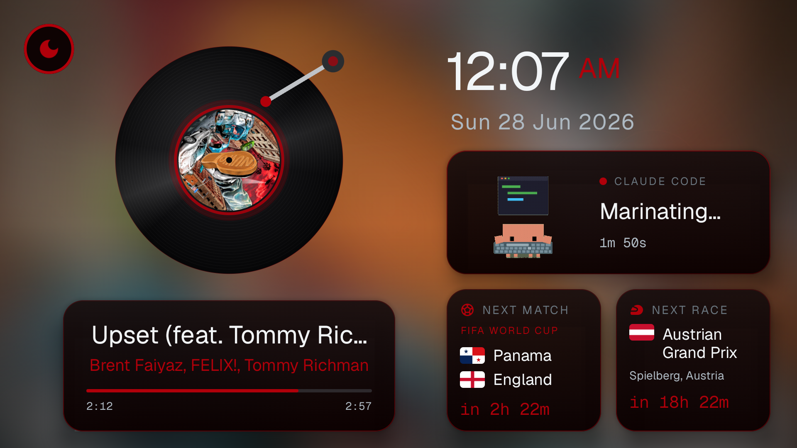
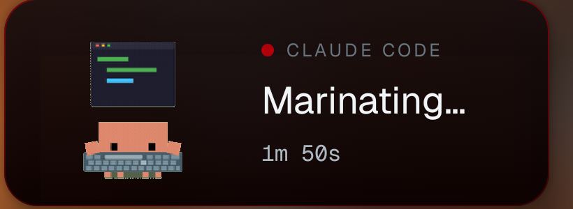

<div align="center">

# 📺 TvPort

### An always-on ambient dashboard for your Android TV that re-themes itself to whatever you're playing — and lets you watch **Claude Code** work from across the room.



<p>
  
  
  
  
  
</p>

</div>

---

TvPort turns a spare TV into a calm, glanceable wall display. One screen, no clutter: your music as a **spinning vinyl record** whose colors bleed into the entire UI, a big clock, the next **World Cup** match and **F1** race with live countdowns — and a little pixel companion that mirrors, in real time, exactly what **Claude Code** is doing in your terminal.

Built end-to-end in **Kotlin + Jetpack Compose for TV**.

## ✨ Highlights

🎵 **Now Playing, as vinyl** — your Spotify track spins on a glossy record with a tracking tonearm and album-art label. The cover sits blurred behind everything, and the **whole page recolors to the album's palette** the instant the track changes.

🤖 **A Claude Code companion** — a pixel creature shows what your AI is doing *right now*: typing while it works, alert when it needs your input, happy when a turn finishes, asleep when idle. State is **pushed from your Mac over SSE** (no polling), with a **live elapsed timer** and a **sound alert** when Claude needs you or wraps up — so you can step away and still know.

⚽ **Next Match** — the upcoming fixture with **team flags** and a live countdown to kickoff (football-data.org).

🏎️ **Next Race** — the next Grand Prix with the host-country flag, circuit, and a live countdown to lights-out (Jolpica / Ergast).

🔋 **Batteries, Apple-widget style** — a green ring per device for your **Mac, iPhone, and AirPods + case**, with a charging bolt. The iPhone level is read **wirelessly over Wi-Fi** — no cable, no Shortcut, no installed app, and it works even while the phone is locked.

🕐 **Clock + date** — big and legible from across the room.

🌙 **Remote-friendly night dim** — one focusable button; press OK on the remote to dim the whole panel when the lights go down.

🛡️ **Made to run 24/7** — gentle pixel-shift burn-in protection and OLED-safe near-black surfaces, so it's happy living on a wall forever.

## 🐾 The star of the show

<div align="center">



</div>

Your Claude Code statusline already writes its state to a small JSON file. A tiny helper on your Mac streams every change over your LAN, and the TV holds one long-lived connection — so the moment Claude starts thinking, picks up a tool, asks for permission, or finishes, the creature reacts and (optionally) chimes. It's oddly delightful to glance up mid-coffee and see your agent still grinding.

## 🧱 How it works

```
┌──────────────┐   SSE push    ┌─────────────────────────────┐
│  Your Mac    │ ────────────► │  Android TV  (this app)     │
│  Claude Code │  state.json   │                             │
│  statusline  │  → serve.py   │  ┌───────────────────────┐  │
└──────────────┘  (LAN :4040)  │  │  Compose for TV UI    │  │
                               │  │  • Vinyl / album theme│  │
   Spotify Web API ──────────► │  │  • Claude companion   │  │
   football-data.org ────────► │  │  • Match / Race tiles │  │
   Jolpica (Ergast) ─────────► │  │  • Battery rings      │  │
                               │  │  • Clock + night dim  │  │
                               │  └───────────────────────┘  │
                               └─────────────────────────────┘
```

- **MVVM + Hilt**, one ViewModel/repository per tile — every tile fails independently and falls back gracefully, so one dead API never blanks the screen.
- **Album-driven theming**: dominant colors are extracted from the cover and animated across accents, borders, and backgrounds on every track change.
- **Push, not poll** for Claude status — a long-lived Server-Sent Events stream with auto-reconnect and an honest "offline" state when the Mac sleeps.
- **Resilient by design**: missing API key → labeled sample data, never a crash or an empty box.
- **Cross-version visuals**: blur is faked via tiny-thumbnail upscaling so it looks right even on Android 11 TVs where `Modifier.blur` doesn't exist.
- **Battery from one endpoint**: the same Mac companion serves `/battery` alongside the Claude status — Mac via `pmset`, AirPods via `system_profiler`, and the iPhone via a wireless lockdown read over Wi-Fi (a pairing record captured once over USB, then fully cable-free). See [`server/README.md`](server/README.md) for setup.

## 🛠️ Tech stack

**Kotlin** · **Jetpack Compose for TV** · **Hilt** · **Coroutines / Flow** · **Retrofit + OkHttp** (incl. SSE) · **Coil** (animated GIF + album art) · **Geist** font (Vercel) · custom Canvas drawing for the vinyl, tonearm, and shine.

---

## 🚀 Quick start

> Already have JDK 17 + the Android SDK + `adb`? This is the whole thing:

```bash
cp secrets.properties.example secrets.properties   # then fill it in (see Setup → Step 2)
./gradlew :app:assembleDebug                        # build the APK
adb connect <your-tv-ip>:5555                       # accept the prompt on the TV
adb install -r app/build/outputs/apk/debug/app-debug.apk
adb shell am start -n com.tvport.dashboard/.MainActivity
```

New to Android dev? The full walkthrough is below. ⬇️

---

## 🧰 What you'll need

- A **Mac or PC** to build the app (one-time)
- An **Android TV / Google TV** (Sony BRAVIA, Chromecast with Google TV, TCL/Hisense, …)
- Both on the **same Wi-Fi**
- A **Spotify** account, and optionally a free **football-data.org** account
- ~30 minutes the first time

## Step 1 — Get the project and build tools

You need a Java JDK 17 and the Android SDK. Two options:

**Easiest — Android Studio**
1. Install **Android Studio**: <https://developer.android.com/studio>
2. **Open** this `tvport` folder in it — the SDK downloads automatically.

**Or — command line (Mac + Homebrew):**
```bash
brew install openjdk@17
brew install --cask android-commandlinetools
echo "sdk.dir=/opt/homebrew/share/android-commandlinetools" > local.properties
yes | sdkmanager --licenses
sdkmanager "platform-tools" "platforms;android-34" "build-tools;34.0.0"
```

## Step 2 — Add your secrets

Secrets stay out of the code in a file the app reads at build time. **It's never committed** (git-ignored).

```bash
cp secrets.properties.example secrets.properties
```
Open `secrets.properties` and fill it in:

### 2a. Spotify (required for Now Playing)
1. <https://developer.spotify.com/dashboard> → **Create app**. Note **Client ID** + **Client Secret**.
2. In the app settings add Redirect URI `http://127.0.0.1:8888/callback` → Save.
3. Paste this in a browser (replace `CLIENT_ID`), Enter, approve:
   ```
   https://accounts.spotify.com/authorize?client_id=CLIENT_ID&response_type=code&redirect_uri=http://127.0.0.1:8888/callback&scope=user-read-currently-playing%20user-read-playback-state
   ```
4. The page won't load — that's fine. Copy the `code=...` value from the URL bar.
5. Trade it for a refresh token (replace the 3 values):
   ```bash
   curl -X POST https://accounts.spotify.com/api/token \
     -d grant_type=authorization_code -d code=PASTE_CODE \
     -d redirect_uri=http://127.0.0.1:8888/callback \
     -u CLIENT_ID:CLIENT_SECRET
   ```
6. Put all three into `secrets.properties`:
   ```
   SPOTIFY_CLIENT_ID=...
   SPOTIFY_CLIENT_SECRET=...
   SPOTIFY_REFRESH_TOKEN=...
   ```
> Now Playing mirrors whatever's playing on your Spotify account (any device). Nothing playing → a
> tidy idle state.

### 2b. Football (optional — Next Match tile)
1. Register free at <https://www.football-data.org/client/register> → they email a token.
2. `FOOTBALL_DATA_TOKEN=your_token`
3. Choose the competition in `CONFIG.md` (`footballCompetition`, default `WC`; or `PL`, `CL`, `PD`…).
> No token → the tile shows a labeled "SAMPLE" match (no crash). Team flags resolve automatically from the nation name.

### 2c. Location
Default is **Kharghar, Navi Mumbai**. Change `latitude`/`longitude` in `CONFIG.md` if you want.

### 2d. Claude companion URL (optional)
Leave `CLAUDE_STATUS_URL` blank unless you're doing Step 6.

## Step 3 — Build the APK

**Android Studio:** **Build → Build APK(s)**.

**Command line:**
```bash
export JAVA_HOME=/opt/homebrew/opt/openjdk@17    # adjust to your JDK
./gradlew :app:assembleDebug
```
Result → `app/build/outputs/apk/debug/app-debug.apk`

## Step 4 — Install on your Google TV

1. **Enable debugging on the TV:**
   - **Settings → System → About →** click **"Android TV OS build" 7 times**.
   - **Settings → System → Developer options →** turn on **Network debugging**.
   - Note the TV's IP: **Settings → Network & Internet → (your Wi-Fi) → IP address** (e.g. `192.168.1.42`).

2. **From your computer** (same Wi-Fi):
   ```bash
   adb connect 192.168.1.42:5555      # ← your TV's IP. Choose "Allow" on the popup that appears ON THE TV
   adb install -r app/build/outputs/apk/debug/app-debug.apk
   adb shell am start -n com.tvport.dashboard/.MainActivity
   ```
   > Says `unauthorized`? Accept the **"Allow USB debugging?"** popup on the TV (tick "Always allow"),
   > then run `adb connect` again.

🎉 The dashboard launches.

## Step 5 — Add to Home & make it always-on

- **Add to Home:** **Home → Apps → Your apps →** find **TvPort Dashboard** → **press & hold** Select →
  **Add to favorites** → "Move" it to the front. *(Not listed? Open it once via Apps → See all apps.)*
- **Stop the screensaver:** **Settings → System → Ambient mode → "When to start screensaver" → Never**.
- **After a TV reboot:** Google TV won't auto-launch apps — open it from favorites once.

## Step 6 — (Optional) The live Claude Code companion

Shows what Claude Code is doing in your terminal, on the TV, in real time. Needs a tiny helper on the
**Mac** you run Claude on, which reads `~/.claude/statusbar/state.json` (the file your Claude statusline
writes — fields `state`, `label`, `project`, `startedAt`).

1. **Status server** — `~/.claude/statusbar/serve.py` reads that file and streams changes over your
   LAN (Server-Sent Events). Install it as a LaunchAgent so it auto-starts on login. Verify:
   ```bash
   curl http://127.0.0.1:4040/status
   ```
2. **Point the app at your Mac** — find your Mac's LAN IP (`System Settings → Wi-Fi → Details → IP`),
   set it in `secrets.properties`, then rebuild + reinstall (Steps 3–4):
   ```
   CLAUDE_STATUS_URL=http://192.168.1.40:4040/status
   ```
3. **Reliability:** reserve a **static IP** for your Mac in your router so the address never changes,
   and keep the Mac **awake** on the same Wi-Fi. Otherwise the companion just shows "offline".

The creature: **typing** while working · **alert + "!"** when it needs you · **happy** when done ·
**asleep** when idle/stopped — plus a soft chime on the "needs you" and "done" transitions. Blank
`CLAUDE_STATUS_URL` simply hides the card; everything else still works.

## 🩹 Troubleshooting

| Problem | Fix |
|---|---|
| `adb: command not found` | Use the full path (`.../platform-tools/adb`) or add it to PATH |
| `adb connect` → `unauthorized` | Accept the "Allow USB debugging" popup on the TV, then reconnect |
| Installs to the wrong device | An emulator is also connected — use `adb -s <tv-ip>:5555 install …` or close the emulator |
| Now Playing stuck on "Nothing playing" | Play a song on Spotify; re-check the refresh token |
| Next Match shows "SAMPLE" | Add a `FOOTBALL_DATA_TOKEN` (Step 2b) |
| Claude companion says "offline" | Mac asleep / off-Wi-Fi / IP changed — see Step 6.3 |
| Background cover isn't blurred | Expected on very old TVs; the app already fakes the blur — update to the latest build |
| Build fails first run | Let Gradle finish downloading; ensure JDK 17 + Android SDK are installed |

## 📁 Project layout

- **`app/`** — the Android app (Kotlin + Compose for TV)
- **`CONFIG.md`** — every tunable (location, units, day/night dim, competition, poll intervals) + defaults
- **`secrets.properties.example`** — template (copy to `secrets.properties`)
- **`docs/`** — screenshots

---

<div align="center">

Built with Kotlin, Compose for TV, and a soft spot for ambient screens. ⭐ it if you put one on your wall.

</div>
